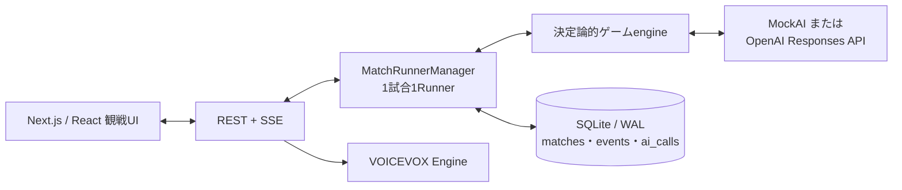

# AI人狼 / AI Werewolf


9人の個性的なAIプレイヤーが、一般的な人狼ゲームを最初から最後まで自律プレイする観戦用Webアプリです。人間はゲームへ参加せず、公開視点またはGM視点から、議論、役職主張、記名投票、夜の行動、決着後の答え合わせを見届けます。

ローカルまたは信頼できるサーバーでのセルフホストを前提としています。開発・テストには決定論的なMockAIを使用でき、最終受け入れ試験に限ってOpenAI Responses APIを利用できます。

## 主な機能

- 標準的な9人人狼を、ゲーム開始から勝敗決定まで完全自動で進行
- 9人それぞれに人格、口調、感情傾向、判断の癖、役職別方針、他者への呼称を設定
- 占い師・霊媒師の公開主張、狂人・人狼の騙り、主張結果を追跡する役職主張ボード
- 公開視点とGM視点をサーバー側で別々に射影し、進行中の秘密情報を分離
- RESTとSSEによるライブ観戦、一時停止、再開、中断、エラー後の再試行
- SQLiteイベントソーシングによる永続化、再起動復旧、保存イベントだけを使うリプレイ
- 開票、投票結果、処刑、襲撃結果、日替わりを見せる全画面演出
- オリジナルBGM、効果音、9人別のVOICEVOX読み上げと個別音量設定
- Web画面からキャラクタープリセットを編集し、JSONで書き出し・読み込み
- 同じseedとMockAIから同じイベントpayload列を生成できる決定論的シミュレーション
- Dockerによる単一プロセス構成のセルフホスト

## ゲームルール

| 役職 | 陣営 | 人数 | 能力 |
|---|---|---:|---|
| 村人 | 村人陣営 | 3 | 特殊能力なし。議論と投票で人狼を探す |
| 人狼 | 人狼陣営 | 2 | 仲間を知り、夜に相談して1名を襲撃する |
| 占い師 | 村人陣営 | 1 | 毎夜1名が人狼か否かを知る |
| 霊媒師 | 村人陣営 | 1 | 前日に処刑された人物が人狼か否かを知る |
| 狩人 | 村人陣営 | 1 | 毎夜1名を襲撃から守る。連続護衛はできない |
| 狂人 | 人狼陣営 | 1 | 人間として判定されるが、人狼陣営の勝利を目指す |

- 第0夜は人狼の顔合わせと占いだけを行い、襲撃はありません。占い先は公開情報がないため、engineがseedから決定論的に選びます。
- 昼は生存者全員に発言機会を保証した動的な自由討論を行います。1発言は200 Unicode code point以内です。
- 投票は情報上同時に行い、全員の票が確定した後で投票者と投票先を一括公開します。棄権と自分への投票はできません。
- 最多同票の場合は同数候補だけで1回決選投票し、再び同数ならその日は処刑なしです。
- 処刑・襲撃時には役職を公開しません。全配役と秘密行動は試合終了または中断後に答え合わせできます。
- 生存人狼が0人なら村人陣営、生存人狼数が生存非人狼数以上なら人狼陣営の勝利です。
- 第9日終了でも決着しない場合は、異常フラグ付きの引き分けとして終了します。

詳細なゲーム進行とAI判断契約は [docs/implementation-plan.md](docs/implementation-plan.md) を参照してください。

## 動作要件

- Node.js 22以上
- npm（`package-lock.json`を使用）
- 1280px以上の幅を持つPCブラウザ（基準表示は1440×900px）
- 任意: [VOICEVOX Engine](https://github.com/VOICEVOX/voicevox_engine)（音声読み上げを使う場合）
- 任意: OpenAI APIキー（実AIによる最終受け入れ試験を行う場合のみ）

スマートフォン向けレイアウト、人間プレイヤー参加、アカウント機能、複数サーバー構成、サーバーレス環境には対応していません。

## クイックスタート

まずはAPI料金の発生しないMockAIで起動してください。

```bash
git clone https://github.com/tegnike/ai-werewolf.git
cd ai-werewolf
npm ci
npm run db:migrate
AI_PROVIDER=mock ALLOW_REAL_AI=0 npm run dev -- -p 3001
```

[http://localhost:3001](http://localhost:3001) を開き、「AI人狼を開始」を選びます。SQLiteのマイグレーションは初回DBアクセス時にも自動適用されるため、以後の起動で`npm run db:migrate`を繰り返す必要はありません。

本番ビルドをローカルで起動する場合は次のとおりです。

```bash
npm run build
PORT=3000 npm run start
```

## 実AIの設定

実AIではOpenAI APIの利用料金が発生します。開発、テスト、CI、UI確認、反復シミュレーションにはMockAIを使い、実AIは自動検証後の最終受け入れ試験だけに使用してください。

`.env.local`を作成します。

```dotenv
OPENAI_API_KEY=your-key
ALLOW_REAL_AI=1
AI_PROVIDER=real
DATABASE_PATH=./data/ai-werewolf.db
VOICEVOX_URL=http://127.0.0.1:50021
```

その後、通常どおり起動します。

```bash
npm run dev -- -p 3001
```

`npm run dev`は現在のワークツリーの`.env.local`を読み込みます。現在のワークツリーにない場合は、Gitのメインワークツリーにある`.env.local`を読み込みます。`AI_PROVIDER=mock`または`ALLOW_REAL_AI=0`をコマンドで明示した場合は、保存済みの実AI設定を読み込みません。

実AIのWeb試合には、次の3条件がすべて必要です。

1. `AI_PROVIDER=real`
2. `ALLOW_REAL_AI=1`
3. `OPENAI_API_KEY`が設定済み

本番モデルは`gpt-5.6-luna`、reasoning effortは`low`に固定されています。別モデルやランダム行動へのフォールバックはありません。1判断につき最大3回まで同じモデルを再試行し、物理API呼び出しは1試合240回を上限とします。

## 環境変数

| 変数 | 既定値 | 用途 |
|---|---|---|
| `AI_PROVIDER` | `mock` | Web画面から開始する試合のAI。`mock`または`real` |
| `ALLOW_REAL_AI` | 未設定 | `1`の場合だけ実AIを許可。`0`はMockAIを明示 |
| `OPENAI_API_KEY` | 未設定 | OpenAI Responses APIのサーバー側APIキー |
| `DATABASE_PATH` | `./data/ai-werewolf.db` | SQLiteデータベースの保存先 |
| `VOICEVOX_URL` | `http://127.0.0.1:50021` | VOICEVOX EngineのベースURL |
| `LOG_LEVEL` | `info` | Pinoのログレベル |
| `APP_URL` | `http://localhost:3000` | OGPなどのmetadata base URL |
| `PORT` | `3000` | 本番サーバーの待受ポート |

APIキーは`.env.local`などGit管理外の場所に保存し、`NEXT_PUBLIC_`から始まる変数へ入れないでください。

## 使い方

### 試合を始める

ホーム画面でseedと進行速度を選びます。seedを空欄にすると自動生成されます。進行速度は最速（待機なし）、標準（1.5秒）、ゆっくり（3秒）の3種類です。同時進行できる試合は最大2件です。

進行中は一時停止、再開、中断ができます。AI判断が失敗した場合はエラー内容を表示して停止し、明示的に再試行するまでランダムな代替行動では進みません。サーバー再起動時は`running`の試合だけを保存イベントから復旧し、一時停止中の試合は勝手に再開しません。

### 観戦する

- 公開視点: 公開発言、記名投票、処刑、夜明けなど、通常の観戦者が知ってよい情報だけを表示します。
- GM視点: 配役、人狼会話、占い・霊媒・護衛・襲撃、AIの短い判断理由を含む秘密イベントを表示します。
- 役職主張ボード: 占い師・霊媒師を名乗った人物と本人が公表した結果を表示します。真偽を証明する表示ではありません。
- プレイヤーカード: 当日の最新発言、生死、死亡日・死因、直近の投票先を表示します。
- 時系列ログ: 投票者と投票先を含む開票結果を日ごとに表示し、終了後の答え合わせでは秘密行動と投票理由も確認できます。
- 演出: 開票の前に一拍置き、得票一覧を全画面で示してから処刑へ進みます。演出の結果が盤面やログへ先行表示されないよう同期します。

公開視点では、秘密イベントの存在だけを内容のない進行ログへ置き換えます。秘密情報をブラウザへ送ってCSSで隠す方式ではありません。

### リプレイする

終了した試合はホームの試合記録または観戦画面からリプレイできます。再生、一時停止、前後移動、シークに対応し、AIやゲームエンジンを再実行せず、SQLiteへ保存されたイベントだけを再生します。

### キャラクターを編集する

ホームの「キャラクターを編集」から、各席について次の設定を変更できます。

- 名前、肩書き、一人称、役職を名乗る台詞
- 根本欲求、欠点、対人バイアス、感情傾向、判断の癖
- 話し方、台詞例、発言量、避ける話し方
- 6役職それぞれの発言・投票・夜行動方針
- 他の8人への個別の呼称
- 立ち絵、VOICEVOX話者ID・表示名・スタイル

立ち絵には2MB以下のPNG、JPEG、WebPを使用できます。プリセットはJSONで書き出し・読み込みでき、各席を初期設定へ戻すこともできます。

編集内容は次に作成する試合から反映されます。試合開始時に9人分の設定をスナップショット保存するため、進行中の試合と過去のリプレイは後から変化しません。

## BGM・効果音・VOICEVOX

- BGM、VOICE、効果音は個別にON/OFFでき、音量は0〜100で調整できます。設定はブラウザへ保存されます。
- 公開視点では公開発言だけ、GM視点では画面へ表示中の人狼会話も読み上げます。
- 発言と対応するログはVOICEの再生開始に同期します。VOICEをOFFにすると即時表示へ戻ります。
- 全話者の読み上げ速度は`speedScale=1.1`です。
- VOICEVOXが利用できない場合も、音声なしでゲーム進行と観戦を続けられます。
- ブラウザの自動再生制限で音が始まらない場合は、画面を一度クリックしてください。

初期話者は次のとおりです。

| プレイヤー | VOICEVOX話者 |
|---|---|
| 名取 澪 | 四国めたん（ノーマル） |
| 天満 ひなた | 満別花丸（元気） |
| 宮下 さくら | 春日部つむぎ（ノーマル） |
| 雨宮 しずく | 雨晴はう（ノーマル） |
| 神崎 レナ | 波音リツ（ノーマル） |
| 黒田 剛 | 玄野武宏（ノーマル） |
| 真壁 陽太 | 白上虎太郎（ふつう） |
| 福本 源蔵 | ちび式じい（ノーマル） |
| 久遠 ひより | 冥鳴ひまり（ノーマル） |

VOICEVOX Engineを起動した状態で次を実行すると、現在の9人の名前と呼称をユーザー辞書へ同期できます。

```bash
npm run voicevox:dictionary
```

同期は冪等で、同じ管理対象を重複登録せず、アプリと無関係な辞書項目は変更しません。

## アーキテクチャ



- Next.js App Router、React、TypeScript
- SQLite WALモードのイベントソーシング
- 常駐`MatchRunnerManager`、1試合1Runner、AI判断は直列実行
- RESTとSSE（`Last-Event-ID`対応、15秒ごとのping）
- OpenAI Responses APIとZod Structured Outputs
- seed付きの決定論的PRNG。`src/`では`Math.random()`を使用しません
- 公開視点はサーバー側のallowlistでpayloadを射影
- リプレイはイベントfoldだけを使用

### データと復旧

既定では`data/ai-werewolf.db`へ次の情報を保存します。

- `matches`: seed、状態、速度、AI種別、キャラクタースナップショット、API呼び出し数
- `events`: 公開・非公開を含む試合の全イベント
- `ai_calls`: call key、リクエストhash、応答、試行状態
- `character_presets`: 次回以降の新規試合に使う編集済みキャラクター

マイグレーションは`migrations/`を番号順に自動適用します。進行中の試合を復旧するときは同じseedと保存済みイベントを再導出して照合し、重複イベントを追加しません。実AI呼び出しの結果が不明な状態では自動的にやり直さず、明示的な再試行を要求します。

## HTTP API

UIが利用する内部APIです。現時点では認証がないため、信頼できないネットワークへ直接公開しないでください。

| Method | Path | 概要 |
|---|---|---|
| `GET` | `/api/matches` | 直近100試合と現在のAI providerを取得 |
| `POST` | `/api/matches` | `{ seed?, speed? }`で試合を作成 |
| `GET` | `/api/match/:id` | `view=public|gm`、`fromSeq`、終了後の`reveal=1`に対応 |
| `POST` | `/api/match/:id/control` | `{ action }`で`pause`、`resume`、`abort`、`retry` |
| `GET` | `/api/match/:id/stream` | 試合イベントのSSE。`Last-Event-ID`と`fromSeq`に対応 |
| `GET` | `/api/characters` | 現在の9人のキャラクタープリセットを取得 |
| `PUT` | `/api/characters` | 1人分の検証済みプリセットを保存 |
| `DELETE` | `/api/characters` | `{ seat }`で1人分を初期設定へ戻す |
| `GET` | `/api/voicevox` | VOICEVOX Engineの利用可否を取得 |
| `POST` | `/api/voicevox` | 試合スナップショットの話者設定で音声を合成 |

## 開発と検証

| コマンド | 内容 |
|---|---|
| `npm run dev` | 開発サーバーを起動 |
| `npm run build` | Next.js standalone本番ビルド |
| `npm run start` | ビルド済みstandaloneサーバーを起動 |
| `npm run lint` | ESLint |
| `npm run typecheck` | TypeScript型チェック |
| `npm test` | 全Vitestテスト |
| `npm run test:unit` | unitテスト |
| `npm run test:integration` | Runnerと永続化のintegrationテスト |
| `npm run test:leak` | 公開視点の秘密情報漏えいテスト |
| `npm run test:e2e` | Playwrightによる1280px・1440pxのE2Eテスト |
| `npm run sim -- --matches 30 --ai mock --seed-base 1000` | MockAIの反復シミュレーション |
| `npm run accept:day1 -- --ai real` | 実AIで1日目の処刑までを最大3 seed保存 |
| `npm run db:migrate` | DBマイグレーションを明示実行 |
| `npm run voicevox:dictionary` | VOICEVOXユーザー辞書を同期 |

標準的な検証手順は次のとおりです。

```bash
npm run lint
npm run typecheck
npm test
npm run build
npm run test:e2e
npm run sim -- --matches 30 --ai mock --seed-base 1000
docker build .
```

すべての自動検証はMockAIだけを使用します。Playwrightは一時SQLite DBと専用ポートを使い、既存の開発DBやOpenAI APIを使用しません。

### CLIでの実AI受け入れ試験

上記の自動検証を通した後、実AIで1試合だけ完走させる場合は次を実行します。

```bash
export OPENAI_API_KEY='your-key'
ALLOW_REAL_AI=1 npm run sim -- --matches 1 --ai real --seed-base 1000
```

CLIでは`--ai real`と`ALLOW_REAL_AI=1`の両方が必要です。APIキーもなければ起動しません。

昼議論の品質変更を検証し、1日目の処刑までの結果JSONとSQLite DBを`tmp/day1-replay/`へ保存する場合は次を使います。このスクリプトは品質の合否を自動判定しません。

```bash
ALLOW_REAL_AI=1 npm run accept:day1 -- --ai real

# 1 seedだけを再現
ALLOW_REAL_AI=1 npm run accept:day1 -- --ai real --seed day1-v3-0

# 最大3 seedを明示
ALLOW_REAL_AI=1 npm run accept:day1 -- --ai real --seeds seed-a,seed-b,seed-c
```

## Docker

```bash
docker compose up --build
```

[http://localhost:3000](http://localhost:3000) でMockAI版が起動します。SQLiteはnamed volume`ai-werewolf-data`の`/data/ai-werewolf.db`へ保存されます。

コンテナはNext.js standaloneの単一常駐Nodeプロセスを前提としています。Vercelなどのサーバーレス、複数インスタンス、水平スケールには対応していません。実AIや別ホストのVOICEVOXをDockerから使用する場合は、composeの環境変数とネットワーク到達性を明示的に設定してください。

## セキュリティとプライバシー

- `OPENAI_API_KEY`はサーバー環境変数だけに置き、Gitやクライアントbundleへ含めないでください。
- prompt、AI本文、秘密役職、非公開行動、APIキーはアプリログへ出しません。ログ項目もPinoでredactします。
- 公開視点には秘密イベントのpayload、役職、判断理由、対象者限定情報を送りません。
- GM視点と操作APIに認証はありません。インターネットへ公開する場合は、リバースプロキシ認証、TLS、IP制限、レート制限を追加してください。
- キャラクター設定には自由入力欄とbase64画像が含まれます。DBとJSONプリセットは信頼できる環境で管理してください。

## ディレクトリ構成

```text
src/app/       Next.jsページとRoute Handlers
src/domain/    役職、イベント、人格、主張、音声などのドメイン定義
src/engine/    ゲーム進行、合法手、議論台帳、勝敗、決定論的PRNG
src/server/    SQLite、Runner、公開射影、OpenAI、VOICEVOX、ログ
src/ui/        観戦画面、キャラクター編集、音声、演出、リプレイ表示
scripts/       シミュレーション、受け入れ試験、DB、VOICEVOX補助スクリプト
test/          unit、integration、leak、E2Eテスト
migrations/    SQLiteマイグレーション
public/assets/  立ち絵、役職画像、背景、BGM、効果音
docs/          実装仕様、受け入れ記録、アセット記録、継続タスク
```

## 関連ドキュメント

- [実装仕様の正本](docs/implementation-plan.md)
- [受け入れ試験レポート](docs/acceptance-report.md)
- [観客体験バックログ](docs/spectator-experience-backlog.md)
- [生成アセット記録](docs/asset-manifest.md)
- [アセット利用条件](ASSETS_LICENSE.md)

## ライセンスと権利

ソースコードは [MIT License](LICENSE) で公開しています。

`public/assets/`の生成画像とオリジナルBGM、CC0効果音はコードとは利用条件が異なります。詳細は [ASSETS_LICENSE.md](ASSETS_LICENSE.md) と [docs/asset-manifest.md](docs/asset-manifest.md) を参照してください。VOICEVOX本体、各音声ライブラリ、キャラクターの利用条件はそれぞれの公式規約に従ってください。

本プロジェクトは、一般的な人狼ゲームの仕組みを独自に実装したオープンソースのAI実験アプリです。特定の人狼ゲーム製品、企業、団体とは関係がなく、提携または承認を受けたものではありません。ルール説明、コード、UI、画像は本プロジェクト独自のものです。
