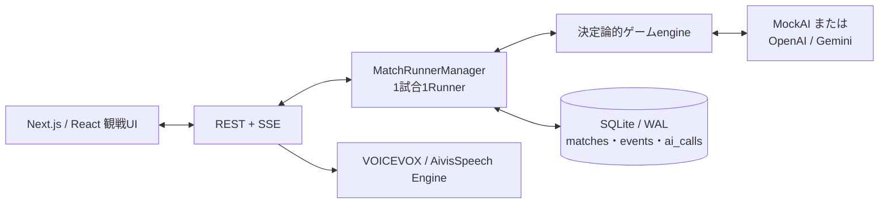

# AI人狼 / AI Werewolf


9人の個性的なAIプレイヤーが、一般的な人狼ゲームを最初から最後まで自律プレイする観戦用Webアプリです。人間はゲームへ参加せず、公開視点またはGM視点から、議論、役職主張、記名投票、夜の行動、決着後の答え合わせを見届けます。

ローカルまたは信頼できるサーバーでのセルフホストを前提としています。開発・テストには決定論的なMockAIを使用でき、最終受け入れ試験ではOpenAIまたはGeminiを選択できます。

## 主な機能

- 標準的な9人人狼を、ゲーム開始から勝敗決定まで完全自動で進行
- 9人それぞれに人格、口調、感情傾向、判断の癖、役職別方針、他者への呼称を設定
- 公開盤面と人格に応じて本人が名乗る・待つ・潜伏を選ぶ役職主張と、結果を追跡する役職主張ボード
- 固定一巡ではない動的な議論キューと、公開発言だけから作る構造化された議論台帳
- 公開視点とGM視点をサーバー側で別々に射影し、進行中の秘密情報を分離
- RESTとSSEによるライブ観戦、一時停止、再開、中断、エラー後の再試行
- SQLiteイベントソーシングによる永続化、再起動復旧、保存イベントだけを使うリプレイ
- 開票、投票結果、処刑、襲撃結果、日替わりを見せる全画面演出
- オリジナルBGM、効果音、VOICEVOX／AivisSpeechによる9人別の先読み付き読み上げと個別音量設定
- OpenAI／Gemini、推論設定、VOICEVOX／AivisSpeechをキャラクターごとに選択
- Web画面からキャラクタープリセットを編集し、JSONで書き出し・読み込み
- 同じseedとMockAIから同じイベントpayload列を生成できる決定論的シミュレーション
- Dockerによる単一プロセス構成のセルフホスト

## ゲームルール

| 役職 | 陣営 | 人数 | 能力 |
|---|---|---:|---|
| 村人 | 村人陣営 | 3 | 特殊能力なし。議論と投票で人狼を探す |
| 人狼 | 人狼陣営 | 2 | 仲間を知り、夜に相談して1名を襲撃する |
| 占い師 | 村人陣営 | 1 | 毎夜1名が人狼か否かを知る |
| 霊媒師 | 村人陣営 | 1 | 前日に処刑された人物が人狼か否かを知る |
| 狩人 | 村人陣営 | 1 | 毎夜1名を襲撃から守る。連続護衛はできない |
| 狂人 | 人狼陣営 | 1 | 人間として判定されるが、人狼陣営の勝利を目指す |

- 第0夜は人狼の顔合わせと占いだけを行い、襲撃はありません。占い先は公開情報がないため、engineがseedから決定論的に選びます。
- 昼は固定の開始発言一巡を置かず、指名への返答、役職主張、未発言者、弁明、発言希望を一つの動的なキューで扱います。生存者全員に最低1回の発言機会を保証し、通常は1人1日2回までです。1発言は200 Unicode code point以内です。
- 投票は情報上同時に行い、全員の票が確定した後で投票者と投票先を一括公開します。棄権と自分への投票はできません。
- 最多同票の場合は同数候補だけで1回決選投票し、再び同数ならその日は処刑なしです。
- 処刑・襲撃時には役職を公開しません。全配役と秘密行動は試合終了または中断後に答え合わせできます。
- 生存人狼が0人なら村人陣営、生存人狼数が生存非人狼数以上なら人狼陣営の勝利です。
- 第9日終了でも決着しない場合は、異常フラグ付きの引き分けとして終了します。

詳細なゲーム進行とAI判断契約は [docs/implementation-plan.md](docs/implementation-plan.md) を参照してください。

## AI議論と役職主張

- 同じ人物が続けて議論を占有しないよう、再発言までに別の2人を挟みます。集中して疑われた本人は優先的に弁明でき、3人以上から投票予定が集まった対象には通常枠を使い切った後も追加反論を1回だけ認めます。
- 各発言は台詞に加えて、質問、回答、疑い先、根拠分類、投票予定などの公開上の立場を構造化して保存します。エンジンはこの議論台帳から最新の立場と既出論点を後続AIへ渡し、存在しない発言・回答・投票予定を根拠にさせません。自由本文を別AIで再解析する処理はありません。
- 真占い師・真霊媒師・狂人・人狼は、キャラクター固有の役職主張設定と現在の公開盤面を読み、通常の昼発言と同じAI応答内で「今名乗る」「公開上の条件を決めて待つ」「潜伏する」を選びます。エンジンは合法な役職・対象・結果候補だけを渡し、公開後の主張は日をまたいでも矛盾しないよう固定します。
- 役職主張ボードは公開発言に含まれた構造化主張だけから作ります。真役職、真結果、非公開の主張方針は参照せず、投票理由から新しい役職主張を行うこともできません。
- 第0夜の占い先には公開情報に基づく推理理由が存在しません。対象はengineがseedから決定論的に選び、1日目の議論でも選定理由を信用比較や攻撃材料として扱わせません。

## 動作要件

- Node.js 22以上
- npm（`package-lock.json`を使用）
- 1280px以上の幅を持つPCブラウザ（基準表示は1440×900px）
- 任意: [VOICEVOX Engine](https://github.com/VOICEVOX/voicevox_engine)または[AivisSpeech Engine](https://github.com/Aivis-Project/AivisSpeech-Engine)（音声読み上げを使う場合）
- 任意: OpenAI APIキーまたはGemini APIキー（実AIによる最終受け入れ試験を行う場合のみ）

スマートフォン向けレイアウト、人間プレイヤー参加、アカウント機能、複数サーバー構成、サーバーレス環境には対応していません。

## クイックスタート

まずはAPI料金の発生しないMockAIで起動してください。

```bash
git clone https://github.com/tegnike/ai-werewolf.git
cd ai-werewolf
npm ci
npm run db:migrate
AI_PROVIDER=mock ALLOW_REAL_AI=0 npm run dev -- -p 3001
```

[http://localhost:3001](http://localhost:3001) を開き、「AI人狼を開始」を選びます。SQLiteのマイグレーションは初回DBアクセス時にも自動適用されるため、以後の起動で`npm run db:migrate`を繰り返す必要はありません。

本番ビルドをローカルで起動する場合は次のとおりです。

```bash
npm run build
PORT=3000 npm run start
```

## 実AIの設定

実AIでは選択したAPIの利用料金が発生します。開発、テスト、CI、UI確認、反復シミュレーションにはMockAIを使い、実AIは自動検証後の最終受け入れ試験だけに使用してください。

`.env.local`を作成します。

```dotenv
OPENAI_API_KEY=your-key
GEMINI_API_KEY=your-gemini-key
ALLOW_REAL_AI=1
AI_PROVIDER=real
GEMINI_MODEL=gemini-2.5-pro
DATABASE_PATH=./data/ai-werewolf.db
VOICEVOX_URL=http://127.0.0.1:50021
AIVISSPEECH_URL=http://127.0.0.1:10101
```

その後、通常どおり起動します。

```bash
npm run dev -- -p 3001
```

`npm run dev`は現在のワークツリーの`.env.local`を読み込みます。現在のワークツリーにない場合は、Gitのメインワークツリーにある`.env.local`を読み込みます。`AI_PROVIDER=mock`または`ALLOW_REAL_AI=0`をコマンドで明示した場合は、保存済みの実AI設定を読み込みません。

実AIのWeb試合には、次の3条件がすべて必要です。

1. `AI_PROVIDER=real`
2. `ALLOW_REAL_AI=1`
3. 保存済みキャラクターが選択しているプロバイダーすべてについて、`OPENAI_API_KEY`または`GEMINI_API_KEY`が設定済み

OpenAIは`gpt-5.6-luna`に固定し、推論レベルは`none / low / medium / high / xhigh / max`からキャラクターごとに選択できます（既定`low`）。Geminiの既定モデルは`gemini-2.5-pro`で、思考トークン予算は自動`-1`または`128〜32768`からキャラクターごとに指定します。設定は試合開始時に9人分を保存します。別プロバイダーやランダム行動への自動フォールバックはありません。1判断につき最大3回まで同じモデル・推論設定を再試行し、物理API呼び出しは1試合240回を上限とします。

## 環境変数

| 変数 | 既定値 | 用途 |
|---|---|---|
| `AI_PROVIDER` | `mock` | Web画面から開始する試合のAI。`mock`または`real` |
| `ALLOW_REAL_AI` | 未設定 | `1`の場合だけ実AIを許可。`0`はMockAIを明示 |
| `OPENAI_API_KEY` | 未設定 | OpenAI Responses APIのサーバー側APIキー |
| `GEMINI_API_KEY` | 未設定 | Gemini APIのサーバー側APIキー |
| `LLM_PROVIDER` | `openai` | CLI受け入れ試験で全キャラクターへ適用するLLM。Web試合はキャラクター設定を使用 |
| `GEMINI_MODEL` | `gemini-2.5-pro` | Gemini選択時のモデル |
| `TTS_PROVIDER` | `voicevox` | CLI実行で全キャラクターへ適用するTTS。Web試合はキャラクター設定を使用 |
| `DATABASE_PATH` | `./data/ai-werewolf.db` | SQLiteデータベースの保存先 |
| `VOICEVOX_URL` | `http://127.0.0.1:50021` | VOICEVOX EngineのベースURL |
| `AIVISSPEECH_URL` | `http://127.0.0.1:10101` | AivisSpeech EngineのベースURL |
| `LOG_LEVEL` | `info` | Pinoのログレベル |
| `APP_URL` | `http://localhost:3000` | OGPなどのmetadata base URL |
| `PORT` | `3000` | 本番サーバーの待受ポート |

APIキーは`.env.local`などGit管理外の場所に保存し、`NEXT_PUBLIC_`から始まる変数へ入れないでください。

## 使い方

### 試合を始める

ホーム画面ではseedと進行速度を選びます。LLM・モデル名・推論設定・TTSは9人それぞれの保存済みキャラクター設定を使用し、試合開始時にスナップショット保存されるため再起動後も変わりません。seedを空欄にすると自動生成されます。進行速度は最速（待機なし）、標準（1.5秒）、ゆっくり（3秒）の3種類です。同時進行できる試合は最大2件です。

進行中は一時停止、再開、中断ができます。AI判断が失敗した場合はエラー内容を表示して停止し、明示的に再試行するまでランダムな代替行動では進みません。サーバー再起動時は`running`の試合だけを保存イベントから復旧し、一時停止中の試合は勝手に再開しません。

### 観戦する

- 公開視点: 公開発言、記名投票、処刑、夜明けなど、通常の観戦者が知ってよい情報だけを表示します。
- GM視点: 配役、人狼会話、占い・霊媒・護衛・襲撃、AIの短い判断理由を含む秘密イベントを表示します。
- 役職主張ボード: 占い師・霊媒師を名乗った人物と本人が公表した結果を表示します。真偽を証明する表示ではありません。
- プレイヤーカード: 当日の最新発言、生死、死亡日・死因、直近の投票先を表示します。
- 時系列ログ: 投票者と投票先を含む開票結果を日ごとに表示し、終了後の答え合わせでは秘密行動と投票理由も確認できます。
- 演出: 開票の前に一拍置き、得票一覧を全画面で示してから処刑へ進みます。演出の結果が盤面やログへ先行表示されないよう同期します。

公開視点では、秘密イベントの存在だけを内容のない進行ログへ置き換えます。秘密情報をブラウザへ送ってCSSで隠す方式ではありません。

### リプレイする

終了した試合はホームの試合記録または観戦画面からリプレイできます。再生、一時停止、前後移動、シークに対応し、AIやゲームエンジンを再実行せず、SQLiteへ保存されたイベントだけを再生します。

### キャラクターを編集する

ホームの「キャラクターを編集」から、9人分の保存枠について次の設定を変更できます。保存枠と試合中の席は別で、試合開始時にseedを使って9人を配置します。

- 名前、肩書き、一人称、役職を名乗る台詞
- 根本欲求、欠点、対人バイアス、感情傾向、判断の癖
- 話し方、台詞例、発言量、避ける話し方
- 6役職それぞれの発言・投票・夜行動方針
- 真役職の公開姿勢と、狂人・人狼の騙り、対抗、混雑許容、自己保全、作戦維持の傾向
- 参加者未定でも選べる既定の呼び方（表示名／名字／下の名前、さん・ちゃん・くん付け、呼び捨て）と、組み合わせ確定後の個別呼称
- キャラクターごとのOpenAI／Gemini、推論設定、VOICEVOX／AivisSpeechの選択
- 立ち絵、VOICEVOX話者ID、AivisSpeechスタイルID、表示名・スタイル

立ち絵には2MB以下のPNG、JPEG、WebPを使用できます。画像は立ち絵エリア、JSONは「JSON読み込み」ボタンへドラッグ＆ドロップでき、どちらもクリック選択にも対応します。共有用プリセットは席未定のJSONで書き出され、読み込み時は現在選択中の保存枠へ反映されます。内容を確認して保存すると、その保存枠だけを上書きします。各保存枠を初期設定へ戻すこともできます。形式と全フィールドの説明は[キャラクタープリセットJSON作成ガイド](docs/character-preset-json.md)を参照してください。

保存枠を別キャラクターへ置き換えた場合、他の初期キャラクターが旧相手へ使っていた既定の個別呼称は新規試合から自動的に外れ、各話者の`defaultAddressStyle`へフォールバックします。置き換え後に明示設定した個別呼称は維持されます。

作成したプリセットは `npm run character:validate -- ./path/to/preset.json` で検証できます。編集画面へのJSON読み込み時にも同じ検証を行い、不正なフィールドと理由を表示します。

すぐに読み込める作成例として、[ニケのキャラクタープリセット](presets/nike.character.json)を同梱しています。

既に人格を持つAIキャラクター本人へ作成を依頼する場合は、[AIキャラクター本人向け 人狼プリセット作成指示書](docs/ai-character-preset-authoring.md)も一緒に渡してください。画像、LLM、TTSなどの必須確認から、作成、検証、成果物の返却までを対話形式で進めるための文書です。

編集内容は次に作成する試合から反映されます。試合開始時に9人分の設定をスナップショット保存するため、進行中の試合と過去のリプレイは後から変化しません。

## BGM・効果音・TTS

- BGM、VOICE、効果音は個別にON/OFFでき、音量は0〜100で調整できます。設定はブラウザへ保存されます。
- 公開視点では公開発言だけ、GM視点では画面へ表示中の人狼会話も読み上げます。
- 発言と対応するログはVOICEの再生開始に同期します。VOICEをOFFにすると即時表示へ戻ります。
- 再生順を変えずに次の2発言まで音声合成を先読みします。クライアントでは発言順に、サーバーでは同じ音声Engineごとに合成を1件ずつ直列化し、過負荷を避けます。
- 一時的な通信失敗、HTTP 408・429・5xxは短い待機を挟んで最大3回まで再試行します。最終的に失敗しても台詞を画面へ表示し、失敗したキャラクターを通知したうえで進行を続けます。
- 一時停止すると再生中の音声、発言キュー、表示位置も止まり、再開時は同じ位置から続けます。発言終了後は話者と台詞を1秒保持してから次へ進みます。
- テンポを保つため、VOICEVOXとAivisSpeechの全話者へ`speedScale=1.1`を適用します。
- あるキャラクターが選択した音声Engineを利用できない場合も、他のキャラクターの読み上げまで無効化しません。
- VOICEをOFFにした場合や観戦画面を閉じた場合は、未再生の先読みをキャンセルします。
- ブラウザの自動再生制限で音が始まらない場合は、画面を一度クリックしてください。

VOICEVOXの初期話者は次のとおりです。AivisSpeechはインストール済みモデルによってスタイルIDが変わるため、キャラクター編集画面で`/speakers`に表示される値を設定してください。未設定の旧プリセットはVOICEVOXの話者設定へフォールバックします。

| プレイヤー | VOICEVOX話者 |
|---|---|
| 名取 澪 | 四国めたん（ノーマル） |
| 天満 ひなた | 満別花丸（元気） |
| 宮下 さくら | 春日部つむぎ（ノーマル） |
| 雨宮 しずく | 雨晴はう（ノーマル） |
| 神崎 レナ | 波音リツ（ノーマル） |
| 黒田 剛 | 玄野武宏（ノーマル） |
| 真壁 陽太 | 白上虎太郎（ふつう） |
| 福本 源蔵 | ちび式じい（ノーマル） |
| 久遠 ひより | 冥鳴ひまり（ノーマル） |

VOICEVOX EngineまたはAivisSpeech Engineを起動した状態で次を実行すると、「人狼」と現在の9人の名前・呼称を各Engineのユーザー辞書へ同期できます。

```bash
npm run voicevox:dictionary
npm run aivisspeech:dictionary
```

必要なEngineのコマンドだけを実行してください。同期は冪等で、同じ管理対象を重複登録せず、アプリと無関係な辞書項目は変更しません。

## アーキテクチャ



- Next.js App Router、React、TypeScript
- SQLite WALモードのイベントソーシング
- 常駐`MatchRunnerManager`、1試合1Runner、AI判断は直列実行
- RESTとSSE（`Last-Event-ID`対応、15秒ごとのping）
- OpenAI Responses API／Gemini APIとZod Structured Outputs
- seed付きの決定論的PRNG。`src/`では`Math.random()`を使用しません
- 公開視点はサーバー側のallowlistでpayloadを射影
- リプレイはイベントfoldだけを使用

### データと復旧

既定では`data/ai-werewolf.db`へ次の情報を保存します。

- `matches`: seed、状態、速度、AI種別、キャラクタースナップショット、API呼び出し数
- `events`: 公開・非公開を含む試合の全イベント
- `ai_calls`: call key、リクエストhash、応答、試行状態
- `character_presets`: 次回以降の新規試合に使う編集済みキャラクター

マイグレーションは`migrations/`を番号順に自動適用します。進行中の試合を復旧するときは同じseedと保存済みイベントを再導出して照合し、重複イベントを追加しません。実AI呼び出しの結果が不明な状態では自動的にやり直さず、明示的な再試行を要求します。

新規試合は、議論、役職主張、第0夜の選択方式をルールmarkerとして`match_created`イベントへ保存します。保存済みの旧試合は当時のmarkerに対応する契約で復旧・再生し、新しいルールへ暗黙に置き換えません。

## HTTP API

UIが利用する内部APIです。現時点では認証がないため、信頼できないネットワークへ直接公開しないでください。

| Method | Path | 概要 |
|---|---|---|
| `GET` | `/api/matches` | 直近100試合とAIモードを取得 |
| `POST` | `/api/matches` | `{ seed?, speed? }`で、保存済みのキャラクター別LLM・TTS設定を使う試合を作成 |
| `GET` | `/api/match/:id` | `view=public|gm`、`fromSeq`、終了後の`reveal=1`に対応 |
| `POST` | `/api/match/:id/control` | `{ action }`で`pause`、`resume`、`abort`、`retry` |
| `GET` | `/api/match/:id/stream` | 試合イベントのSSE。`Last-Event-ID`と`fromSeq`に対応 |
| `GET` | `/api/characters` | 現在の9人のプリセットとカスタマイズ済み保存枠を取得 |
| `PUT` | `/api/characters` | 1人分の検証済みプリセットを保存 |
| `DELETE` | `/api/characters` | `{ seat }`で1人分を初期設定へ戻す |
| `GET` | `/api/tts?matchId=...` | 試合内のキャラクターが使う音声エンジンの利用可否を取得 |
| `POST` | `/api/tts` | 発言キャラクターのスナップショット済みTTS・話者設定で音声を合成 |
| `GET/POST` | `/api/voicevox` | 旧クライアント向け互換エンドポイント |

## 開発と検証

| コマンド | 内容 |
|---|---|
| `npm run dev` | 開発サーバーを起動 |
| `npm run build` | Next.js standalone本番ビルド |
| `npm run start` | ビルド済みstandaloneサーバーを起動 |
| `npm run lint` | ESLint |
| `npm run typecheck` | TypeScript型チェック |
| `npm test` | 全Vitestテスト |
| `npm run test:unit` | unitテスト |
| `npm run test:integration` | Runnerと永続化のintegrationテスト |
| `npm run test:leak` | 公開視点の秘密情報漏えいテスト |
| `npm run test:e2e` | Playwrightによる1280px・1440pxのE2Eテスト |
| `npm run sim -- --matches 30 --ai mock --seed-base 1000` | MockAIの反復シミュレーション |
| `npm run accept:day1 -- --ai real` | 実AIで1日目の処刑までを最大3 seed保存 |
| `npm run character:validate -- ./path/to/preset.json` | キャラクタープリセットJSONを検証 |
| `npm run db:migrate` | DBマイグレーションを明示実行 |
| `npm run voicevox:dictionary` | VOICEVOXユーザー辞書を同期 |
| `npm run aivisspeech:dictionary` | AivisSpeechユーザー辞書を同期 |

標準的な検証手順は次のとおりです。

```bash
npm run lint
npm run typecheck
npm test
npm run build
npm run test:e2e
npm run sim -- --matches 30 --ai mock --seed-base 1000
docker build .
```

すべての自動検証はMockAIだけを使用します。Playwrightは一時SQLite DBと専用ポートを使い、既存の開発DBやOpenAI／Gemini APIを使用しません。

### CLIでの実AI受け入れ試験

上記の自動検証を通した後、実AIで1試合だけ完走させる場合は次を実行します。

```bash
export OPENAI_API_KEY='your-key'
export LLM_PROVIDER='openai'
ALLOW_REAL_AI=1 npm run sim -- --matches 1 --ai real --seed-base 1000
```

CLIでは`--ai real`と`ALLOW_REAL_AI=1`の両方が必要です。`LLM_PROVIDER`に対応するAPIキーもなければ起動しません。

昼議論の品質変更を検証し、1日目の処刑までの結果JSONとSQLite DBを`tmp/day1-replay/`へ保存する場合は次を使います。このスクリプトは品質の合否を自動判定しません。

```bash
ALLOW_REAL_AI=1 npm run accept:day1 -- --ai real

# 1 seedだけを再現
ALLOW_REAL_AI=1 npm run accept:day1 -- --ai real --seed day1-v3-0

# 最大3 seedを明示
ALLOW_REAL_AI=1 npm run accept:day1 -- --ai real --seeds seed-a,seed-b,seed-c
```

## Docker

```bash
docker compose up --build
```

[http://localhost:3000](http://localhost:3000) でMockAI版が起動します。SQLiteはnamed volume`ai-werewolf-data`の`/data/ai-werewolf.db`へ保存されます。

コンテナはNext.js standaloneの単一常駐Nodeプロセスを前提としています。Vercelなどのサーバーレス、複数インスタンス、水平スケールには対応していません。実AIや別ホストのVOICEVOX／AivisSpeechをDockerから使用する場合は、composeの環境変数とネットワーク到達性を明示的に設定してください。

## セキュリティとプライバシー

- `OPENAI_API_KEY`と`GEMINI_API_KEY`はサーバー環境変数だけに置き、Gitやクライアントbundleへ含めないでください。
- prompt、AI本文、秘密役職、非公開行動、APIキーはアプリログへ出しません。ログ項目もPinoでredactします。
- 公開視点には秘密イベントのpayload、役職、判断理由、対象者限定情報を送りません。
- GM視点と操作APIに認証はありません。インターネットへ公開する場合は、リバースプロキシ認証、TLS、IP制限、レート制限を追加してください。
- キャラクター設定には自由入力欄とbase64画像が含まれます。DBとJSONプリセットは信頼できる環境で管理してください。

## ディレクトリ構成

```text
src/app/       Next.jsページとRoute Handlers
src/domain/    役職、イベント、人格、主張、音声などのドメイン定義
src/engine/    ゲーム進行、合法手、議論台帳、勝敗、決定論的PRNG
src/server/    SQLite、Runner、公開射影、OpenAI／Gemini、VOICEVOX／AivisSpeech、ログ
src/ui/        観戦画面、キャラクター編集、音声、演出、リプレイ表示
scripts/       シミュレーション、受け入れ試験、プリセット検証、DB、TTS辞書同期
presets/       読み込み・カスタマイズ用のキャラクタープリセット例
test/          unit、integration、leak、E2Eテスト
migrations/    SQLiteマイグレーション
public/assets/  立ち絵、役職画像、背景、BGM、効果音
docs/          実装仕様、受け入れ記録、アセット記録、継続タスク
```

## 関連ドキュメント

- [実装仕様の正本](docs/implementation-plan.md)
- [受け入れ試験レポート](docs/acceptance-report.md)
- [観客体験バックログ](docs/spectator-experience-backlog.md)
- [キャラクタープリセットJSON作成ガイド](docs/character-preset-json.md)
- [AIキャラクター本人向けプリセット作成指示書](docs/ai-character-preset-authoring.md)
- [生成アセット記録](docs/asset-manifest.md)
- [アセット利用条件](ASSETS_LICENSE.md)

## ライセンスと権利

ソースコードは [MIT License](LICENSE) で公開しています。

`public/assets/`の生成画像とオリジナルBGM、CC0効果音はコードとは利用条件が異なります。詳細は [ASSETS_LICENSE.md](ASSETS_LICENSE.md) と [docs/asset-manifest.md](docs/asset-manifest.md) を参照してください。VOICEVOX／AivisSpeech本体、各音声ライブラリ、キャラクターの利用条件はそれぞれの公式規約に従ってください。

本プロジェクトは、一般的な人狼ゲームの仕組みを独自に実装したオープンソースのAI実験アプリです。特定の人狼ゲーム製品、企業、団体とは関係がなく、提携または承認を受けたものではありません。ルール説明、コード、UI、画像は本プロジェクト独自のものです。
